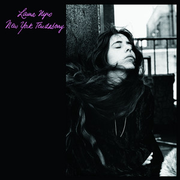
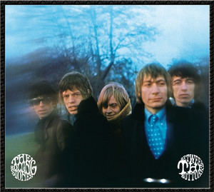

## Rockhistorier
### Et hvert hjem med respekt for sig selv

Klaus Lynggaard og Henrik Queitsch

D. 13. april 2017 

bliver ikke fortalt kronologisk, den bliver fortalt fragmentarisk.

```
```

#### Bob Dylan – Live 1966 (The "Royal Albert Hall" Concert) 
```
20210514 Bob Dylans piratplader Intet er renere end Dylan og en 2 spors båndoptager på et koldt hotelværelse
[00:30:25] Koncert stunder hjemme så kan det kun gå for langsomt ja, han skaffer. Det er Sådan den skal stå i ethvert hjem med eller uden respekt for sig selv. Sådan er det bare og og Sådan er det altså Det er én af Det er nok en af de 5 bedste lege plader nogensinde og uk Jeg har talt så ser kommer til Danmark fra 17 maj 1966 er den optaget?
```

#### Bob Dylan – More Blood, More Tracks (The Bootleg Series Vol. 14)

```
20210514 Bob Dylans piratplader Intet er renere end Dylan og en 2 spors båndoptager på et koldt hotelværelse
[00:55:59] Altså dem der har gjort en ven der hed ja lige præcis rullede joints eller hvad de nu gjorde. Ja nu sagde vi først er Volvo three og voldum 4 var helt uomgængelig i disse Google x Series. Nu er vi så nået frem til nummer 14. Den må jeg nok også med skam melde at den er man altså også nødt til at have, hvis man overhovedet vil have et hjem med respekt for sig selv. Det er den der hedder Moore, blot mor tricks som er optagelserne til hvad hedder det tricks og historien er kort, Vi har fortalt den før, men vi kan lige rekapitulere at.
```
#### Bob Dylan – Side Tracks

```
20210514 Bob Dylans piratplader Intet er renere end Dylan og en 2 spors båndoptager på et koldt hotelværelse
[01:08:23] Både af officielle udgivelser, og at Det var på en greatest hits og uofficielt har nogle live versioner af nogle ting man kendte i forvejen. Det var Sådan en og de uofficielle ting, han nu om stunder samlet på et album der hedder sejt træk som er svine godt. Det er rigtig godt. Det er jo alle de ting som kom ud, men som er kommet ud efterfølgende med ikke at få de rigtige par Dylan plade så det Det er en ja, Det er et super godt. Det er godt rigtig godt triple album, så selvfølgelig også bør stå i ethvert hjem jamen altså altså der skal altså en meter bob Det har alle mennesker for, men her kommer banen som i øvrigt også et nummer.
```

#### Japan – Quiet Life 

```
20210618 De bedste singler fra det herrens år 1981 Hvilke sange står tilbage nu 40 år efter
[01:16:14] Og jeg fandt den sti, som de fleste forbinder dem med i dag, fordi Der er blevet ret anderledes. B 2 førstepladser. Altså Det var Det var glimrende eller acclaim. Ja de var jo New York dolls fanatiker, den i startede. Det kunne man godt se på det, men det kunne man faktisk høre så meget. Nej, de var ikke de 2 lige et par plader før de fandt deres sang, Det var faktisk på det album hedder kuwait live Det var det konturerne begynder at tegne Sådan det skal det skal stå i et hvert hjem respekt for sig selv, men her kommer hele derfra kroater alt.
```

##### Nancy Wilson/Cannonball Adderley - Nancy Wilson/Cannonball Adderley

```
20190129 Dem vi mistede i 2018 Året hvor vi mistede både Benny Andersen og Aretha Franklin
[00:38:56] Fra et album der kom II 1962, det eneste de desværre det eneste de lavede sammen. Hun lavede så blandt andet også et andet meget godt plade, en meget god ikke blive sammen med George shearing, ja en pianist, og så ses senere i karrieren med ramsey Lewis, som ikke er helt så så fede som. Men Det er især den her så meget. Altså Det er det, Det er den, så den bør stå i enhver respekt for sig selv. Det er rigtigt hvert sammen med alle de andre der bør stå der og Det er kan vi sige erfaring, det bliver til mange. 
```

#### The Neville Brothers – Yellow Moon

```
20190129 Dem vi mistede i 2018 Året hvor vi mistede både Benny Andersen og Aretha Franklin
[00:58:52] Det er ******* smukt det her heling tjent fra hvad hedder det nabos blade ihjel om ugen? Og Det er jo endnu en af de plader som bør stå i et hvert hjem.
```

#### Tony Joe White – Black And White 

```
20190129 Dem vi mistede i 2018 Året hvor vi mistede både Benny Andersen og Aretha Franklin
[01:21:05] William domain Jones, som er en ret avanceret anti racistisk sang ja så man fra fra og det debutalbum hedder Black and white. Altså for nu sker det ud i pap, og Det er i øvrigt også en af de plader der bør stå i.
```

#### This Mortal Coil – It'll End In Tears 
#### This Mortal Coil – Blood 
#### This Mortal Coil – Filigree & Shadow 

```
20190129 Dem vi mistede i 2018 Året hvor vi mistede både Benny Andersen og Aretha Franklin
[01:34:34] Det var Det var, Det var første gang, jeg hørte det nummer her er juler, hvor jeg Sådan spidsede ører, og så står der skrevet noget under tom rap. Det var dengang man kunne læse på pladerne, hvem der havde skrevet nogle og så videre, og jeg kunne ikke gå ud og Google hvem Det var, men jeg havde heldigvis nogle ting, kan jeg stående på hylden, så kunne jeg finde ud af, at Det var han havde været med i et band, der hed følelses forsvind, og så fik jeg endnu et par plader, som bør stå i ethvert hjem.
```

#### Bob Marley & The Wailers – Exodus

```
20180420 Den britiske ska-bølge (1979 - 1982) En musikalsk forsoning midt i det kriseramte England
[00:07:01] Fortalte sin gode ven bogmarked om det, der foregik i England nu, og det gjorde så borgelig. 79 lavede nummeret, der hedder punky reggae party. Vi har bedt siden på jamming inde i øvrigt endnu en fantastisk tolder, som der bør stå i ethvert hjem, og det handler selvfølgelig om at at der var altså der var noget fælles front.
```

#### Elvis Presley – From Elvis In Memphis 
#### Elvis – Back In Memphis 

```
20180530 Elvis Presley - 2. del (1960'erne) En stribe klassikere midt i en trædemølle af lortefil
[01:46:09] I februar 69. Jamen den var jo lige så fed og udløste måske ikke lige så mange hitsingler man lige så mange gode numre. Det var dér som havnede på de hjælpere, der hedder elvis in memphis og baking memphis, og den bør man straks opsøge pladebutikker anskaffe sig, fordi i legede sig. De skal stå i et hvert hjem med respekt for sig selv, og så skal man købe tilhørende singler også fordi Det var det, der var ret utrolig. Devar at mange af de store single hits for den periode, de havnede ikke på albummet hernede, så meget overskudsmaterialer i denne periode, at han kunne tillade sig den luksus, men vi springer lynhurtigt videre til nummeret strategier end mig.
```

#### ??? ??? ???

```
20190206 Françoise Hardy En emblematisk figur indenfor yé-yé-bølgen.
[01:43:32] Ja som jo også i Sådan der bør stå præcist o et i ethvert hjem med respekt for sig selv, og Jeg kan da allerede godt nu love at.
```

#### 

```
```

#### 

```
```

##### Laura Nyro - Eli and the Thirteenth Confession
##### Laura Nyro - New York Tendaberry
##### Laura Nyro - More Than a New Discovery



```
20230428 Laura Nyro Få kender hende, men englen i mørket fortjener at komme frem i lyset
Henrik Queitsch og Klaus Lynggaard dykker ned i, hvad de mener, er en række af mesterværker med albums som ’Eli and the Thirteenth Confession’, 
’New York Tendaberry’ og ’More Than a New Discovery’ - som bør stå i et hvert hjem med respekt for sig selv.
- fra podcast beskrivelsen
```

##### Marvin Gaye - What's Going On

```
20231027 Sange om klimakrisen
00:18:11 -> 00:18:32 :  Yeah, nu skal vi så til en af soulmusikkens store, endnu en som også døde alt for tidligt,
00:18:32 -> 00:18:34 :  fordi hans far skød om.
00:18:34 -> 00:18:37 :  Ja, det er selvfølgelig Marvin Gaye, vi snakker om.
00:18:37 -> 00:18:44 :  Og vi skal høre det jo et ord fra hans helt, helt store plade, "What's going on?", som jo er en bona fida klassiker,
00:18:44 -> 00:18:46 :  som bør stå i et hvert hjem med respekt for sig.
00:18:46 -> 00:18:47 :  Ja, det er der ikke.
00:18:47 -> 00:18:48 :  Sådan er det bare.
00:18:48 -> 00:18:53 :  Og det var hans første plade, hvor han ligesom selv får lov at bestemme det hele.
```

##### The Rolling Stones - Between The Buttons

```
20231215 The Rolling Stones Brian Jones-æraen
01:40:38 -> 01:40:41 :  Og den har sådan sin egen stille charme, kan man sige
01:40:41 -> 01:40:44 :  Ja, og jeg synes jo også, det er en af de blæder, der bør stå i et hvert hjem
01:40:44 -> 01:40:45 :  Med respekt for sig selv
01:40:45 -> 01:40:49 :  Men det gælder nok stås 10-12 stones albums
01:40:49 -> 01:40:50 :  Det må man sige, ja
01:40:50 -> 01:40:52 :  Og der er en sjov sang der på
01:40:52 -> 01:40:53 :  Den sidste sang på side 2
01:40:53 -> 01:40:55 :  Something happened to me yesterday
01:40:55 -> 01:40:57 :  Hvor Kies han tegnede sin første
```

##### David Crosby – If I Could Only Remember My Name

```
20240209 En krans for de døde i 2023
01:01:06 -> 01:01:07 :  Og det er altså også en af de plader,
01:01:07 -> 01:01:09 :  som for at nu bruge en fast frase her,
01:01:09 -> 01:01:12 :  der bør stå et hvert hjem med respekt for sig selv.
01:01:12 -> 01:01:12 :  Det bør den, ja.
01:01:12 -> 01:01:13 :  Det er en god plade.
01:01:13 -> 01:01:14 :  Det er en virkelig god plade.
01:01:15 -> 01:01:16 :  Og vi har valgt et nummer derfra,
01:01:16 -> 01:01:18 :  som er meget typisk for pladen,
01:01:18 -> 01:01:18 :  der hedder
01:01:18 -> 01:01:20 :  The Malpas High at About Three,
01:01:20 -> 01:01:21 :  hvad det så skal betyde.
```

##### Nancy Wilson/Cannonball Adderley - Nancy Wilson/Cannonball Adderley

```
20240628 Gæstebud med Anna Roemer Riffs for alle pengene
00:57:49 -> 00:57:53 :  Hvis man har LP'en, er der jo på side 1, er det kun hende og ham.
00:57:53 -> 00:57:55 :  På side 2, er det kun ham og bandet.
00:57:55 -> 00:57:57 :  Men godt lille orkester.
00:57:57 -> 00:57:58 :  Det er det.
00:57:58 -> 00:58:01 :  Og det er den plade, der bare hedder Nancy Wilson og Kanderen Borg Adderley.
00:58:01 -> 00:58:04 :  Og det er en af de plader, som bør stå i et hvert hjem med respekt for sig selv.
00:58:04 -> 00:58:05 :  Det er så ikke bare ret i.
```