## Rockhistorier
### I et hvert hjem med respekt for sig selv

En fragmentarisk albumliste af Klaus Lynggaard og Henrik Queitsch. 

*Kunstig intelligens har fanget alle øjeblikke, hvor vores musikkuratorer nævner: 'I ethvert hjem med respekt for sig selv'.*

* TOC
{:toc}

Albumliste:

- Marvin Gaye - What's Going On 
- Sparks - Kimono My House 
- Sparks - A Woofer In Tweeter's Clothing
- Sparks - Sparks
- John Cale - Helen Of Troy 
- John Cale - Slow Dazzle 
- John Cale - Fear 
- Bob Marley & The Wailers - Exodus
- Pretty Things - S.F. Sorrow 
- Elvis Presley - From Elvis In Memphis 
- Elvis - Back In Memphis 
- Frank Sinatra - Frank Sinatra Sings For Only The Lonely
- Nancy Wilson/Cannonball Adderley - Nancy Wilson/Cannonball Adderley
- The Neville Brothers - Yellow Moon
- Tony Joe White - Black And White 
- This Mortal Coil - It'll End In Tears 
- This Mortal Coil - Blood 
- This Mortal Coil - Filigree & Shadow 
- Serge Gainsbourg - Histoire de Melody Nelson
- Jan Johansson - Jazz På Svenska 
- Lee Hazlewood - Forty 
- ABBA - The Visitors
- The Kinks - Face To Face 
- The Louvin Brothers - Satan Is Real 
- Gram Parsons - GP 
- Dissing - Dissing
- Nick Drake - Pink Moon
- Nick Drake - Bryter Layter
- Nick Drake - Five Leaves Left
- Thin Lizzy - Black Rose (A Rock Legend) 
- Propaganda - A Secret Wish
- Waylon Jennings - Singer Of Sad Songs 
- Waylon Jennings • Willie Nelson • Johnny Cash • Kris Kristofferson - Highwayman 
- Jimi Hendrix - Electric Ladyland
- Jimi Hendrix - Axis: Bold as Love
- Jimi Hendrix - Are You Experienced
- The Band - The Band 
- Bob Dylan - Live 1966 (The "Royal Albert Hall" Concert) 
- Bob Dylan - More Blood, More Tracks (The Bootleg Series Vol. 14)
- Bob Dylan - Side Tracks
- Baby Huey - The Baby Huey Story - The Living Legend 
- Japan - Quiet Life
- Nancy Sinatra and Lee Hazlewood- Nancy & Lee
- Laura Nyro - Eli and the Thirteenth Confession
- Laura Nyro - New York Tendaberry
- Laura Nyro - More Than a New Discovery
- Magazine - Real Life
- Magazine - Secondhand Daylight
- Magazine - The Correct Use of Soap
- Marvin Gaye - What's Going On
- The Rolling Stones - Between The Buttons
- David Crosby - If I Could Only Remember My Name
- Nancy Wilson/Cannonball Adderley - Nancy Wilson/Cannonball Adderley

#### Marvin Gaye - What's Going On
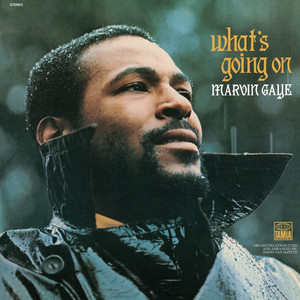
> 2017 05 10 Motown (1959 - 1971) Et musikalsk powerhouse der skabte hits på samlebånd  
  [01:59:54] Så Der er helt lang række mange gæs i spil her, som synger til og mod hinanden og og Det er Det er virkelig mesterligt. Det er ikke kun en mesterlig sang, Det er også en mesterlig produktion. Det må man sige og en mesterlig plade i det hele taget. Den den bør stå i ethvert hjem. Ja vi slutter på toppen med marvin gaye og.

#### Sparks - Kimono My House 
#### Sparks - A Woofer In Tweeter's Clothing
#### Sparks - Sparks
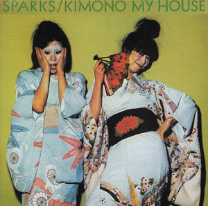
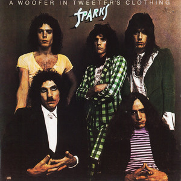
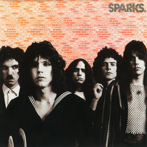
> 2017 05 24 Glamrock Et opgør med autenticitetsbegrebet i rocken  
  [02:05:21] Ja lad os bare kalde det det. Det er hysteri helt ud helt ud. Ja fordi at vi smidt de er til falset sang mine damer og herrer så er de kommet det helt rigtige sted hen og Det er jo et band som de lavede så dengang en bliver første 3 lr som sparkes er alle sammen kanoniserede klassikere og bør stå i ethvert hjem med respekt for sig selv, så dalede det lidt en periode, men de har faktisk de seneste 10 år så lavet en stribe glimrende plader igen at de lavede faktisk sidste år en plade sammen med franz ferdinand.

#### John Cale - Helen Of Troy 
#### John Cale - Slow Dazzle 
#### John Cale - Fear 
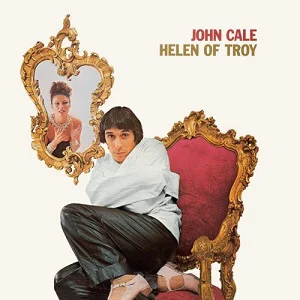
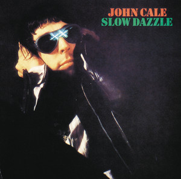
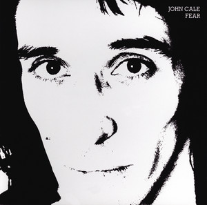
> 2017 08 30 Geniale coverversioner - 2. del  
  [00:25:46] Regulere rock han har lavet ballade og han har lavet soundtracks og nærmest klassisk musik og så videre. Og men men én af hans gyldne perioder, Det er det man kalder oven på på selskabet aylan. Dér midt i halvfjerdserne. Man har udgivet 3 plader helen of troy og slog dazzle og fer som som som er 3 plader der bør stå i ethvert hjem, hvis man spørger mig, men på den ene med den midterste af dem slog tassel.

#### Bob Marley & The Wailers - Exodus
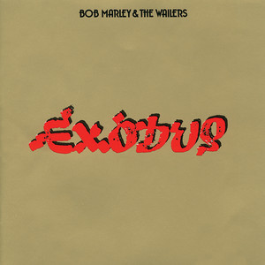
> 2018 04 20 Den britiske ska-bølge (1979 - 1982) En musikalsk forsoning midt i det kriseramte England  
  [00:07:01] Fortalte sin gode ven bogmarked om det, der foregik i England nu, og det gjorde så borgelig. 79 lavede nummeret, der hedder punky reggae party. Vi har bedt siden på jamming inde i øvrigt endnu en fantastisk tolder, som der bør stå i ethvert hjem, og det handler selvfølgelig om at at der var altså der var noget fælles front.

#### Pretty Things - S.F. Sorrow 
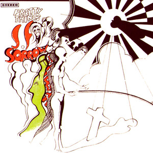
> 2018 05 02 The Pretty Things Tidens mest møgbeskidte og primitive R&B  
  [01:06:49] Og nu er vi nået frem til, kan vi sige, appelsinen i turbanen.  
  Ja, det kan man godt. Det korte og lange er, at de her to numre var en del af processen. De brugte næsten et helt år nu. Selvfølgelig ikke uafbrudt, men de fik på en hel anden måde adgang til studiotid, som de ikke har haft tidligere, og det har været fede tider. Beatles var i Studio 1 og lavede det hvide dobbeltalbum (The Beatles) og Pink Floyd var i Studio 3 og lavede Saucerful of Secrets.
  Så der har flydt noget kreative safter over Abbey Road i de år.  
  Det må sige. Kog på de kreative gryder.Phill May og og Dick Tater er  
  Det handler og S.F Ja, vi kan tale i timevis om hvor fantastisk det album er. Det er et album der bør stå i ethvert hjem med respekt for sig selv.   
  Henrik har ret.  
  [01:12:08] Tale i timevis om fantastisk. Det er, at Det er et album, der bør stå i ethvert hjem. Med respekt for sig selv, så er det sagt. Henrik har ret, hvad hedder det? Men lad os høre åbningsnummer.  
  [01:15:22] Sc respawn, som ikke overraskende var åbningsnummeret på mesterværket sfs euro og nu plæderede jeg det før, at Det er et hjem eller et album, der bør stå i ethvert hjem, men det bliver ikke bare stå i ethvert hjem man skal. Det bliver stå i et hvert hjem i morgen udgaven, og Det er så desværre ikke den Vi har her. Det må vi bare fordi den hvad hedder det? Den lyder simpelthen bare det ligesom bilinspektion peber, selvom Det er Sådan psykedelisk spraglet album, så lyder det simpelthen bare bedre i morgen, og Det var også fordi de var.

#### Elvis Presley - From Elvis In Memphis 
#### Elvis - Back In Memphis 
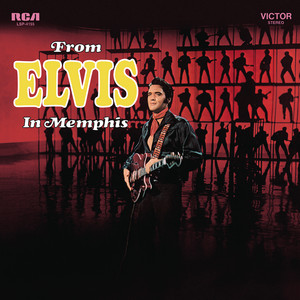
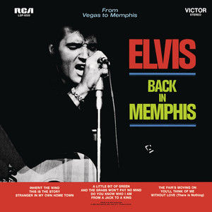
> 2018 05 30 Elvis Presley - 2. del (1960'erne) En stribe klassikere midt i en trædemølle af lortefil  
  [01:46:09] I februar 69. Jamen den var jo lige så fed og udløste måske ikke lige så mange hitsingler man lige så mange gode numre. Det var dér som havnede på de hjælpere, der hedder elvis in memphis og baking memphis, og den bør man straks opsøge pladebutikker anskaffe sig, fordi i legede sig. De skal stå i et hvert hjem med respekt for sig selv, og så skal man købe tilhørende singler også fordi Det var det, der var ret utrolig. Devar at mange af de store single hits for den periode, de havnede ikke på albummet hernede, så meget overskudsmaterialer i denne periode, at han kunne tillade sig den luksus, men vi springer lynhurtigt videre til nummeret strategier end mig.

#### Frank Sinatra - Frank Sinatra Sings For Only The Lonely
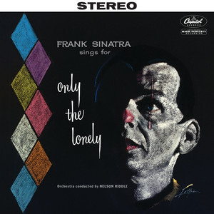
> 2018 12 18 Frank Sinatra (1954 - 1962) Der er sangere - og så er der Sinatra  
  [01:23:32] Uomgængelige mesterværk, men Jeg synes, at du plejer at sige heller ikke den skal stå i ethvert hjem, hvis man skal selv. Og Det var sgu så faktisk også have været godt tænkes der både skulle have arrangeret og og og dirigerede orkestret i denne her sammenhæng, men af årsager jeg ligesom har glemt, så blev det sgu i retten og det tror jeg, vi kan være rigtig glade for, fordi Det er på en måde måske klimakset i samarbejdet. De tog også fat i nelson riddle har jo selv været en stor personlig tragedie igennem de indspillet, både hans.

##### Nancy Wilson/Cannonball Adderley - Nancy Wilson/Cannonball Adderley
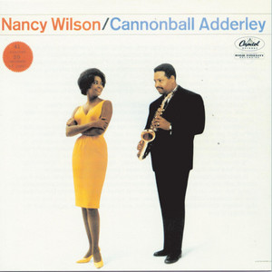
> 2019 01 29 Dem vi mistede i 2018 Året hvor vi mistede både Benny Andersen og Aretha Franklin  
  [00:38:56] Fra et album der kom II 1962, det eneste de desværre det eneste de lavede sammen. Hun lavede så blandt andet også et andet meget godt plade, en meget god ikke blive sammen med George shearing, ja en pianist, og så ses senere i karrieren med ramsey Lewis, som ikke er helt så så fede som. Men Det er især den her så meget. Altså Det er det, Det er den, så den bør stå i enhver respekt for sig selv. Det er rigtigt hvert sammen med alle de andre der bør stå der og Det er kan vi sige erfaring, det bliver til mange. 

#### The Neville Brothers - Yellow Moon
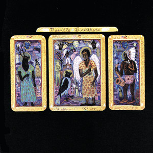
> 2019 01 29 Dem vi mistede i 2018 Året hvor vi mistede både Benny Andersen og Aretha Franklin  
  [00:58:52] Det er ******* smukt det her heling tjent fra hvad hedder det nabos blade ihjel om ugen? Og Det er jo endnu en af de plader som bør stå i et hvert hjem.

#### Tony Joe White - Black And White 
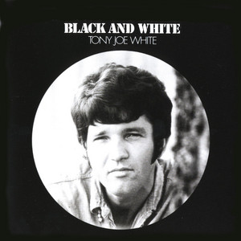
> 2019 01 29 Dem vi mistede i 2018 Året hvor vi mistede både Benny Andersen og Aretha Franklin  
  [01:21:05] William domain Jones, som er en ret avanceret anti racistisk sang ja så man fra fra og det debutalbum hedder Black and white. Altså for nu sker det ud i pap, og Det er i øvrigt også en af de plader der bør stå i.

#### This Mortal Coil - It'll End In Tears 
#### This Mortal Coil - Blood 
#### This Mortal Coil - Filigree & Shadow 
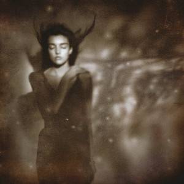
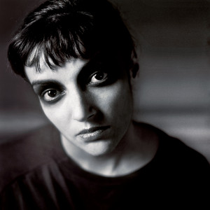
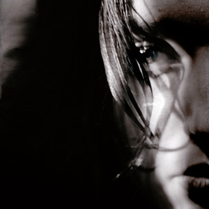
> 2019 01 29 Dem vi mistede i 2018 Året hvor vi mistede både Benny Andersen og Aretha Franklin  
  [01:34:34] Det var Det var, Det var første gang, jeg hørte det nummer her er juler, hvor jeg Sådan spidsede ører, og så står der skrevet noget under tom rap. Det var dengang man kunne læse på pladerne, hvem der havde skrevet nogle og så videre, og jeg kunne ikke gå ud og Google hvem Det var, men jeg havde heldigvis nogle ting, kan jeg stående på hylden, så kunne jeg finde ud af, at Det var han havde været med i et band, der hed følelses forsvind, og så fik jeg endnu et par plader, som bør stå i ethvert hjem.

#### Serge Gainsbourg - Histoire de Melody Nelson (TODO)
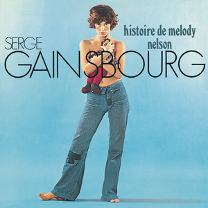
> 2019 02 06 Françoise Hardy En emblematisk figur indenfor yé-yé-bølgen.  
  [01:43:32] Ja som jo også i Sådan der bør stå præcist o et i ethvert hjem med respekt for sig selv, og Jeg kan da allerede godt nu love at.

#### Jan Johansson - Jazz På Svenska 
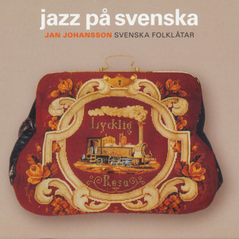
> 2019 02 12 Sange fra Sverige På svensk lyder selv banaliteter godt  
  [01:49:49] Endnu en af de plader, som bør stå i ethvert rigtigt hjem. Ja, men nu får vi cornelia se jorden Sådan her anno 1966.

#### Lee Hazlewood - Forty 
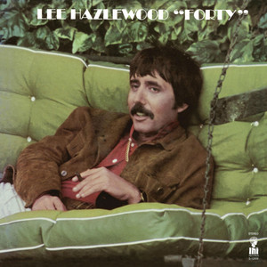
> 2019 03 06 Gæstebud med Jens Unmack Varme anbefalinger fra den dengang ene af to punks i Viborg.  
  [01:30:57] Der er flere af dem, der hører under Vores berømte kategori, bør stå i ethvert ordentligt hjem. Ja, og så bliver jeg så lige pludselig halvfjerdserne, så bliver de lige præcis nå de havde spillet, så lavede han nogle skrækkelige, men du har valgt på et af mesterværkerne bare i baby og året han 69, så Jeg tror bare vi kastede os ud i det, fordi at Vi har stadigvæk noget oppe i ærmet kommer her.

#### ABBA - The Visitors
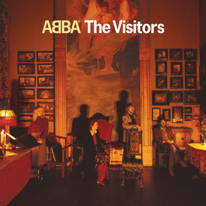
> 2019 05 21 Sange om ulykkelig kærlighed Både Billie Holiday, Frank Ocean og Hank Williams besynger tabet, længslen og smerten.  
  [01:21:20] Citerer mig selv en af de plader, der bør stå i ethvert ordentligt hjem vidste tors med abba året af 1981.

#### The Kinks - Face To Face 
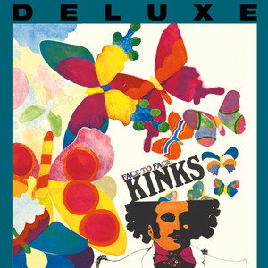
> 2019 06 18 The Kinks (1964 - 1971) Davies er en af 60’er-rockens vigtigste og mest velformulerede sangskrivere  
  [00:48:05] I din smag heller ikke, men men det hører også med til historien, at Sonja efter nogle var at finde på bandets første helstøbte album faste face som mine damer herrer bør stå i ethvert hjem med respekt for sig selv. Det er et mesterværk og det første lige præcis det jeg ville. Takke ja det første, deres fjerde album og det første hvor de har skrevet alle sangene selv, og Det er så ray Davis der har skrevet dem og også den 1 hvor den dér bløde stil, som man nok kommer til at sige med et dominerende i deres.

#### The Louvin Brothers - Satan Is Real 
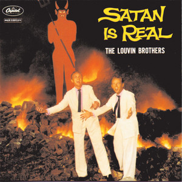
> 2019 09 25 Gram Parsons En visionær syntese af rock, soul, blues og country.  
  [00:35:28] Men også nogle country klassikere, simpelthen blandt andet luven brothers, som er Sådan et band, hvis man skal Sådan ret langt ned i dejen, før man hører om. Hvis man ser så countrymusik, så er det til gengæld altså også virkelig værd at stifte bekendtskab med, som du vil sige deres pladesalg burde jo stå i ethvert hjem med respekt for chatten om ikke andet bare på grund af coveret, som er helt fantastisk. Ja hvad hedder det og hvad skal det måske huske på det her tidspunkt, Der er countrymusik helt out altså II de hippe kredse og i hippie kredsene.

#### Gram Parsons - GP 
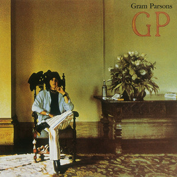
> 2019 09 25 Gram Parsons En visionær syntese af rock, soul, blues og country.  
  [01:38:31] Stod et færd hjem med respekt for sig selv. Man kan også høre altså.

#### Dissing - Dissing
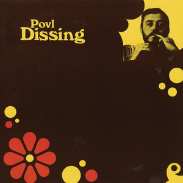
> 2020 05 09 Sange om forår Både Michael Stipe og Povl Dissing er inspireret af årstiden, der ofte lover mere end den kan holde.  
  [01:35:48] Bør stå i ethvert hjem med respekt for sig selv, så fordi jeg fik det sagt den ikke. Her kommer dissing bitters og torup eller og Benny Holst 1969 anemone smil.

#### Nick Drake - Pink Moon
#### Nick Drake - Bryter Layter
#### Nick Drake - Five Leaves Left
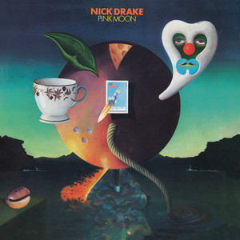
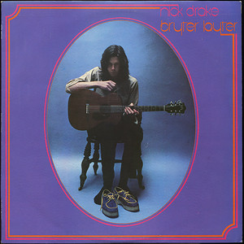
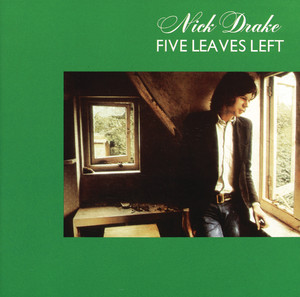
> 2020 05 16 Nick Drake (1948 - 1974) Et tidsløst udtryk, der aldrig mister sin relevans for følsomme sjæle  
  [01:58:40] Henrik jo jeg må sende nogen ud for at få købt ja men hvad hedder det man skal starte med de 3 brødre der kom i hans levetid? Det er hovedværkerne og Det er som jeg ynder at sige her 3 bedre der bør stå i ethvert anstændigt hjem og med de ord siger vi tak for i dag håber i har nydt det lige så meget og hørte lige så meget som Vi har nydt og lave det.

#### Thin Lizzy - Black Rose (A Rock Legend) 
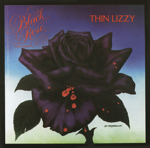
> 2020 05 23 Sange om og fra Irland Fra Van Morrison til Róisín Murphy  
  [01:33:11] Går til de næststørste altså for mig er Det er det største, fordi jeg elsker jo sine lizzy gør jeg også og vild med fedt eller det synes han er en noget undervurderet sangskriver han solo Bladet er også ***** god ***** gode, men altså det vil sige, Der er i hvert fald 1, 4 5 np som bør stå i ethvert.  
  [01:33:31] Hjem med respekt for sig selv ikke Det er ked af. Jeg må sige, at det her det Vi skal høre et nummer fra én af dem der grusomt assist de store blade er det der hvad som han lightning for 83 den altså meget undervurderet den. Det er Sådan meget hård plade ja den elsker, men okay vi kan godt lege Det er den sidste store plade, men Jeg synes faktisk at andre end lytning er også på mange måder et mesterværk, men Black crowes at den den sidste plade der bliver regnet på den måde at folk som går op i den slags Det kan vi jo ikke nej og Vi skal høre titelnummer derfra, som jo faktisk på pladen har en.

#### Propaganda - A Secret Wish
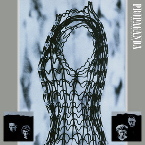
> 2020 06 13 Synth-pop (1974 - 1985) En af popmusikkens vigtigste og mest vidtrækkende nybrud  
  [01:58:37] Dine albums lade den der sikret, hvis Det er det man skal have. Ja Det er det til gengæld en rigtig god plade fra start til slut. Simpelthen Det er en en Det er en synd synes godt Albert ja Det er symphonic sendt ud endnu, og Jeg synes Det er et dejligt stort sted og stoppe med et mesterværk som vi heller ikke plejer at sige. Der bør stå i et hvert hjem med respekt for sig selv og helst faktisk boede på lrc. Det er fordi de er ret forskellige Steen der var mere plads på den og Det er som du siger Sådan symfonisk værk der har de helt endnu mere på det bliver den ikke dårligere af og så vidt jeg husker er der et cover.

#### Waylon Jennings - Singer Of Sad Songs 
#### Waylon Jennings • Willie Nelson • Johnny Cash • Kris Kristofferson - Highwayman 
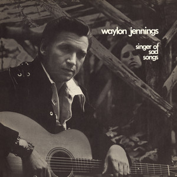
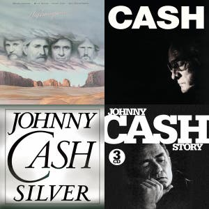
> 2020 07 04 Glemte favoritter De mange favoritkunstnere, vi ikke har spillet endnu  
  [00:28:03] Men man skal. Jeg synes altså ethvert hjem, så skal jeg vel have 1 5 6.

#### Jimi Hendrix - Electric Ladyland
#### Jimi Hendrix - Axis: Bold as Love
#### Jimi Hendrix - Are You Experienced
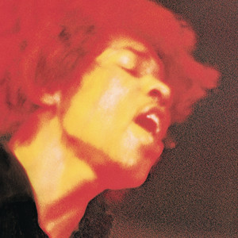

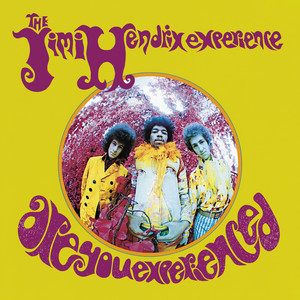
> 2020 10 30 Jimi Hendrix En psykedelisk rejse med hippieepokens ypperligste  
  [01:19:41] Som Henrik bare at sige, den bør stå i ethvert hjem med respekt for alle de 3 eksperimenter. Altså Der er ikke noget, og de skal selvfølgelig helst stå på træk.

#### The Band - The Band 
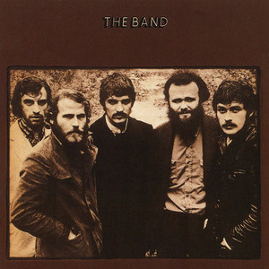
> 2021 05 07 The Band (1960-1977) Indfangede essensen af den nordamerikanske sjæl  
  [01:11:02] King harvesters hurtigt komme og skal vi ikke bare springe ud i den Claus du taler for sig selv? Det er så vidt man jo så synger her. Endnu en fantastisk sang fra albummet the band, som jeg plejer at sige. Det er egentlig blevet, der skal stå i ethvert hjem. Godt Henrik, Det var også lidt på det.

#### Bob Dylan - Live 1966 (The "Royal Albert Hall" Concert) 
#### Bob Dylan - More Blood, More Tracks (The Bootleg Series Vol. 14)
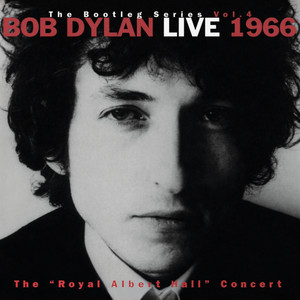
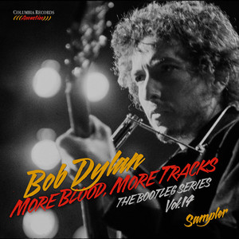
> 2021 05 14 Bob Dylans piratplader Intet er renere end Dylan og en 2 spors båndoptager på et koldt hotelværelse  
  [00:55:59] Altså dem der har gjort en ven der hed ja lige præcis rullede joints eller hvad de nu gjorde. Ja nu sagde vi først er Volvo three og voldum 4 var helt uomgængelig i disse Google x Series. Nu er vi så nået frem til nummer 14. Den må jeg nok også med skam melde at den er man altså også nødt til at have, hvis man overhovedet vil have et hjem med respekt for sig selv. Det er den der hedder Moore, blot mor tricks som er optagelserne til hvad hedder det tricks og historien er kort, Vi har fortalt den før, men vi kan lige rekapitulere at.

#### Bob Dylan - Side Tracks
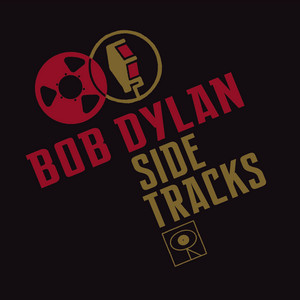

> 2021 05 14 Bob Dylans piratplader Intet er renere end Dylan og en 2 spors båndoptager på et koldt hotelværelse  
  [01:08:23] Både af officielle udgivelser, og at Det var på en greatest hits og uofficielt har nogle live versioner af nogle ting man kendte i forvejen. Det var Sådan en og de uofficielle ting, han nu om stunder samlet på et album der hedder sejt træk som er svine godt. Det er rigtig godt. Det er jo alle de ting som kom ud, men som er kommet ud efterfølgende med ikke at få de rigtige par Dylan plade så det Det er en ja, Det er et super godt. Det er godt rigtig godt triple album, så selvfølgelig også bør stå i ethvert hjem jamen altså altså der skal altså en meter bob Det har alle mennesker for, men her kommer banen som i øvrigt også et nummer.

#### Baby Huey - The Baby Huey Story - The Living Legend 
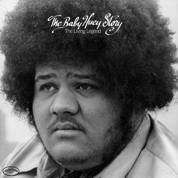
> 2021 05 28 One Album Wonders Ensomme mesterværker der lyser nattehimlen op  
  [00:33:14] Ja, Det er det bør stå i ethvert hjem med respekt for sig selv, så Vi skal høre den person du udgivende ved 

#### Japan - Quiet Life 
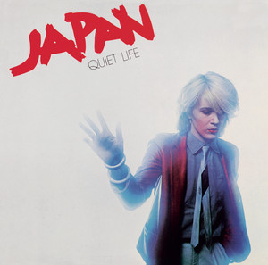
> 2021 06 18 De bedste singler fra det herrens år 1981 Hvilke sange står tilbage nu 40 år efter  
  [01:16:14] Og jeg fandt den sti, som de fleste forbinder dem med i dag, fordi Der er blevet ret anderledes. B 2 førstepladser. Altså Det var Det var glimrende eller acclaim. Ja de var jo New York dolls fanatiker, den i startede. Det kunne man godt se på det, men det kunne man faktisk høre så meget. Nej, de var ikke de 2 lige et par plader før de fandt deres sang, Det var faktisk på det album hedder kuwait live Det var det konturerne begynder at tegne Sådan det skal det skal stå i et hvert hjem respekt for sig selv, men her kommer hele derfra kroater alt.

---

#### Nancy Sinatra and Lee Hazlewood- Nancy & Lee
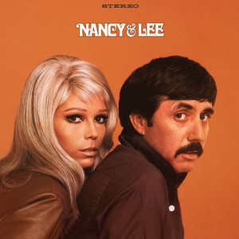
> 2022 04 08 Favorit duetter Fra Bing Crosby og Frank Sinatra til Jay-Z og Alicia Keys  
  00:30:57 -> 00:30:58 :  En af de plader  
  00:30:58 -> 00:30:59 :  Som skal stå i et værd hjem  
  00:30:59 -> 00:31:00 :  Med respekt for sig selv  
  00:31:00 -> 00:31:01 :  Og det mener vi  
  00:31:01 -> 00:31:02 :  Vi kommer og tjekker  

#### Laura Nyro - Eli and the Thirteenth Confession
#### Laura Nyro - New York Tendaberry
#### Laura Nyro - More Than a New Discovery
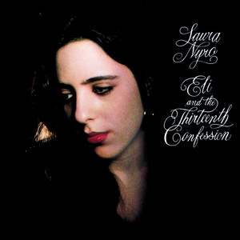
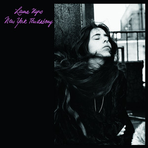
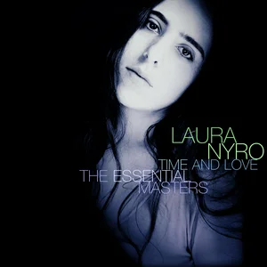
> 2023 04 28 Laura Nyro Få kender hende, men englen i mørket fortjener at komme frem i lyset  
  Henrik Queitsch og Klaus Lynggaard dykker ned i, hvad de mener, er en række af mesterværker med albums som ’Eli and the Thirteenth Confession’,   
  ’New York Tendaberry’ og ’More Than a New Discovery’ - som bør stå i et hvert hjem med respekt for sig selv.  
  - fra podcast beskrivelsen  

#### Magazine - Real Life
#### Magazine - Secondhand Daylight
#### Magazine - The Correct Use of Soap
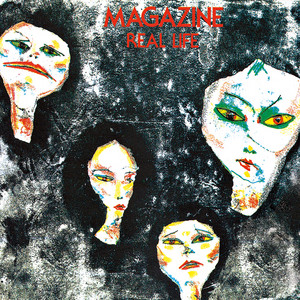
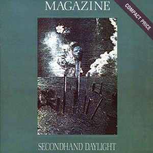
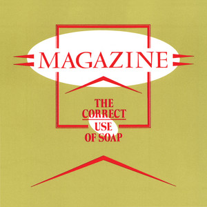
> 2023 08 18 Siouxsie & the Banshees Hun skabte en ny punklyd og blev et stilikon for hele goth-bølgen.mp3  
  00:37:54 -> 00:37:55 :  De tre første magazineplader  
  00:37:55 -> 00:37:57 :  Som, hvad du plejer at sige  
  00:37:57 -> 00:37:57 :  Bør stå i  
  00:37:57 -> 00:37:58 :  Ja, på et hvert hjem  
  00:37:58 -> 00:37:59 :  Med respekt for sig selv  
  00:37:59 -> 00:37:59 :  Simpelthen  
  00:37:59 -> 00:37:59 :  Sådan er det  

#### Marvin Gaye - What's Going On

> 2023 10 27 Sange om klimakrisen  
  00:18:11 -> 00:18:32 :  Yeah, nu skal vi så til en af soulmusikkens store, endnu en som også døde alt for tidligt,  
  00:18:32 -> 00:18:34 :  fordi hans far skød om.  
  00:18:34 -> 00:18:37 :  Ja, det er selvfølgelig Marvin Gaye, vi snakker om.  
  00:18:37 -> 00:18:44 :  Og vi skal høre det jo et ord fra hans helt, helt store plade, "What's going on?", som jo er en bona fida klassiker,  
  00:18:44 -> 00:18:46 :  som bør stå i et hvert hjem med respekt for sig.  
  00:18:46 -> 00:18:47 :  Ja, det er der ikke.  
  00:18:47 -> 00:18:48 :  Sådan er det bare.  
  00:18:48 -> 00:18:53 :  Og det var hans første plade, hvor han ligesom selv får lov at bestemme det hele.  

#### The Rolling Stones - Between The Buttons

> 2023 12 15 The Rolling Stones Brian Jones-æraen  
  01:40:38 -> 01:40:41 :  Og den har sådan sin egen stille charme, kan man sige  
  01:40:41 -> 01:40:44 :  Ja, og jeg synes jo også, det er en af de blæder, der bør stå i et hvert hjem  
  01:40:44 -> 01:40:45 :  Med respekt for sig selv  
  01:40:45 -> 01:40:49 :  Men det gælder nok stås 10-12 stones albums  
  01:40:49 -> 01:40:50 :  Det må man sige, ja  
  01:40:50 -> 01:40:52 :  Og der er en sjov sang der på  
  01:40:52 -> 01:40:53 :  Den sidste sang på side 2  
  01:40:53 -> 01:40:55 :  Something happened to me yesterday  
  01:40:55 -> 01:40:57 :  Hvor Kies han tegnede sin første  

#### David Crosby - If I Could Only Remember My Name

> 2024 02 09 En krans for de døde i 2023  
  01:01:06 -> 01:01:07 :  Og det er altså også en af de plader,  
  01:01:07 -> 01:01:09 :  som for at nu bruge en fast frase her,  
  01:01:09 -> 01:01:12 :  der bør stå et hvert hjem med respekt for sig selv.  
  01:01:12 -> 01:01:12 :  Det bør den, ja.  
  01:01:12 -> 01:01:13 :  Det er en god plade.  
  01:01:13 -> 01:01:14 :  Det er en virkelig god plade.  
  01:01:15 -> 01:01:16 :  Og vi har valgt et nummer derfra,  
  01:01:16 -> 01:01:18 :  som er meget typisk for pladen,  
  01:01:18 -> 01:01:18 :  der hedder  
  01:01:18 -> 01:01:20 :  The Malpas High at About Three,  
  01:01:20 -> 01:01:21 :  hvad det så skal betyde.

#### Nancy Wilson/Cannonball Adderley - Nancy Wilson/Cannonball Adderley

> 2024 06 28 Gæstebud med Anna Roemer Riffs for alle pengene  
  00:57:49 -> 00:57:53 :  Hvis man har LP'en, er der jo på side 1, er det kun hende og ham.  
  00:57:53 -> 00:57:55 :  På side 2, er det kun ham og bandet.  
  00:57:55 -> 00:57:57 :  Men godt lille orkester.  
  00:57:57 -> 00:57:58 :  Det er det.  
  00:57:58 -> 00:58:01 :  Og det er den plade, der bare hedder Nancy Wilson og Kanderen Borg Adderley.  
  00:58:01 -> 00:58:04 :  Og det er en af de plader, som bør stå i et hvert hjem med respekt for sig selv.  
  00:58:04 -> 00:58:05 :  Det er så ikke bare ret i.  
