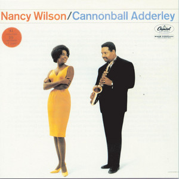

# Et hvert hjem med respekt for sig selv

*** 20230428 Laura Nyro Få kender hende, men englen i mørket fortjener at komme frem i lyset
Henrik Queitsch og Klaus Lynggaard dykker ned i, hvad de mener, er en række af mesterværker med albums som ’Eli and the Thirteenth Confession’, 
’New York Tendaberry’ og ’More Than a New Discovery’ - som bør stå i et hvert hjem med respekt for sig selv.

20231027 Sange om klimakrisen.mp3
00:18:11 -> 00:18:32 :  Yeah, nu skal vi så til en af soulmusikkens store, endnu en som også døde alt for tidligt,
00:18:32 -> 00:18:34 :  fordi hans far skød om.
00:18:34 -> 00:18:37 :  Ja, det er selvfølgelig Marvin Gaye, vi snakker om.
00:18:37 -> 00:18:44 :  Og vi skal høre det jo et ord fra hans helt, helt store plade, "What's going on?", som jo er en bona fida klassiker,
00:18:44 -> 00:18:46 :  som bør stå i et hvert hjem med respekt for sig.
00:18:46 -> 00:18:47 :  Ja, det er der ikke.
00:18:47 -> 00:18:48 :  Sådan er det bare.
00:18:48 -> 00:18:53 :  Og det var hans første plade, hvor han ligesom selv får lov at bestemme det hele.

20231215 The Rolling Stones Brian Jones-æraen.mp3
01:40:38 -> 01:40:41 :  Og den har sådan sin egen stille charme, kan man sige
01:40:41 -> 01:40:44 :  Ja, og jeg synes jo også, det er en af de blæder, der bør stå i et hvert hjem
01:40:44 -> 01:40:45 :  Med respekt for sig selv
01:40:45 -> 01:40:49 :  Men det gælder nok stås 10-12 stones albums
01:40:49 -> 01:40:50 :  Det må man sige, ja
01:40:50 -> 01:40:52 :  Og der er en sjov sang der på
01:40:52 -> 01:40:53 :  Den sidste sang på side 2
01:40:53 -> 01:40:55 :  Something happened to me yesterday
01:40:55 -> 01:40:57 :  Hvor Kies han tegnede sin første

## David Crosby – If I Could Only Remember My Name

20240209 En krans for de døde i 2023.mp3

01:01:06 -> 01:01:07 :  Og det er altså også en af de plader,

01:01:07 -> 01:01:09 :  som for at nu bruge en fast frase her,

01:01:09 -> 01:01:12 :  der bør stå et hvert hjem med respekt for sig selv.

01:01:12 -> 01:01:12 :  Det bør den, ja.

01:01:12 -> 01:01:13 :  Det er en god plade.

01:01:13 -> 01:01:14 :  Det er en virkelig god plade.

01:01:15 -> 01:01:16 :  Og vi har valgt et nummer derfra,

01:01:16 -> 01:01:18 :  som er meget typisk for pladen,

01:01:18 -> 01:01:18 :  der hedder

01:01:18 -> 01:01:20 :  The Malpas High at About Three,

01:01:20 -> 01:01:21 :  hvad det så skal betyde.

https://open.spotify.com/album/4v9ZAufvuQKvTLcy21y6BM?si=ItKsIa4SQTSsCVr5e7q90g

https://www.discogs.com/master/84859-David-Crosby-If-I-Could-Only-Remember-My-Name

https://i.discogs.com/72BLJ92mAceJYzBk_41YqoI3hlR6p0dR8eWUgki43AQ/rs:fit/g:sm/q:90/h:600/w:600/czM6Ly9kaXNjb2dz/LWRhdGFiYXNlLWlt/YWdlcy9SLTEwNjE1/NDQtMTI3MTE5MDc1/OS5qcGVn.jpeg

## Nancy Wilson/Cannonball Adderley - Nancy Wilson/Cannonball Adderley

20240628 Gæstebud med Anna Roemer Riffs for alle pengene

00:57:49 -> 00:57:53 :  Hvis man har LP'en, er der jo på side 1, er det kun hende og ham.

00:57:53 -> 00:57:55 :  På side 2, er det kun ham og bandet.

00:57:55 -> 00:57:57 :  Men godt lille orkester.

00:57:57 -> 00:57:58 :  Det er det.

00:57:58 -> 00:58:01 :  Og det er den plade, der bare hedder Nancy Wilson og Kanderen Borg Adderley.

00:58:01 -> 00:58:04 :  Og det er en af de plader, som bør stå i et hvert hjem med respekt for sig selv.

00:58:04 -> 00:58:05 :  Det er så ikke bare ret i.

https://open.spotify.com/album/6yyNgCQNsJ3VJ9PP7CmvLJ?si=MPGggGvMSHGDwoQowRtEXw

https://www.discogs.com/master/118121-Nancy-Wilson-Cannonball-Adderley-Nancy-Wilson-Cannonball-Adderley

https://i.discogs.com/_gVf68ZzFKYqV3PNmLYvjQmRuGm4TZnMk5WTUEFf65M/rs:fit/g:sm/q:90/h:471/w:469/czM6Ly9kaXNjb2dz/LWRhdGFiYXNlLWlt/YWdlcy9SLTY1MTky/ODQtMTQyMTA5MDgw/MS0xNzQ0LmpwZWc.jpeg
